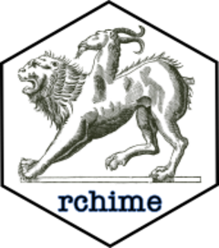

<!-- README.md is generated from README.Rmd. Please edit that file -->

```{r, include = FALSE}
library(rchime)
knitr::opts_chunk$set(
  collapse = TRUE,
  comment = "#>",
  fig.path = "man/figures/README-",
  out.width = "100%"
)
```

# rchime <a href="https://mothur.org/rchime/"></a>

<!-- badges: start -->
[](https://github.com/mothur/rchime/actions/workflows/R-CMD-check.yaml)
[](https://app.codecov.io/gh/mothur/rchime)
[](https://github.com/mothur/rchime/actions/workflows/pkgdown.yaml)
<!-- [](https://CRAN.R-project.org/package=rchime) -->
<!--[](https://CRAN.R-project.org/package=rchime) -->
[](https://orcid.org/0000-0002-6935-4275)
[](https://orcid.org/0009-0001-1529-8247)
<!-- badges: end -->

## Overview 

The *rchime* package allows you to detect and remove chimeras from your dataset using a de novo approach or alternatively a reference model. This package uses 
code from the [vsearch](https://github.com/torognes/vsearch) tools.

* `rchime()` detect and remove chimeras from your [strollur](https://mothur.org/strollur/) dataset object or data.frame

## Installation

You can install the CRAN version with:

```{r, eval = FALSE}
install.packages("rchime")
```

## Development version

You can install the development version of rchime from [GitHub](https://github.com/mothur/rchime) with:

```{r, eval = FALSE}
pak::pak("mothur/rchime")
```

## Usage

The `rchime()` function accepts [strollur](https://mothur.org/strollur/) objects or data.frames as inputs. Let's create a [strollur::strollur](https://mothur.org/strollur/reference/strollur.html) object using files from [mothur's](https://mothur.org) [Miseq_SOP](https://mothur.org/wiki/miseq_sop/) example analysis. Then we will use the *de novo* method in `rchime()` to detect and remove the chimeras from the dataset.

```{r example}
fasta_data <- readRDS(rchime_example("miseq_fasta.rds"))
abundance_data <- readRDS(rchime_example("miseq_abundance.rds"))

data <- strollur::new_dataset("rchime de novo example")

strollur::add(data, table = fasta_data, type = "sequence")
strollur::assign(data, table = abundance_data, type = "sequence_abundance")

chimera_report <- rchime(data)

data
```

## References

Many thanks for the great work of the
*[vsearch](https://github.com/torognes/vsearch/graphs/contributors)* and
*[uchime](https://www.drive5.com/usearch/manual/chimeras.html)* teams!

  * Rognes T, Flouri T, Nichols B, Quince C, Mahé F. (2016) VSEARCH: a
    versatile open source tool for metagenomics. PeerJ 4:e2584.
    doi: 10.7717/peerj.2584

  * Edgar,R.C., Haas,B.J., Clemente,J.C., Quince,C. and Knight,R. (2011),
    UCHIME improves sensitivity and speed of chimera detection.
    Bioinformatics 27:2194. 
    
## Code of Conduct
  
Please note that the rchime project is released with a [Contributor Code of
Conduct](http://mothur.org/rchime/CODE_OF_CONDUCT.html). By contributing to this
project, you agree to abide by its terms.
